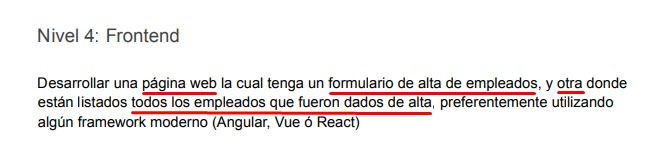

# Challenge SOTAMIT - Backend

## Introducción
Esta aplicación fue desarrollada siguiendo los requerimientos del challenge, sin embargo, identifiqué algunos aspectos en la consigna que dejaban ciertos espacios en blanco en términos de seguridad y buenas prácticas en el desarrollo.

## Motivación y Mejoras Propuestas
En la especificación original se solicitaba desarrollar:



Consideré que permitir el acceso libre a la lista completa de empleados, sin ningún mecanismo de seguridad, representaba un riesgo al exponer la información sensible de la base de datos. Para solucionar esto, implementé un sistema de autenticación y autorización con las siguientes mejoras:

* #### Sistema de Login y Registro:
  + Se incorporó un formulario de registro y login para garantizar que solo usuarios autenticados puedan acceder a las rutas protegidas y realizar acciones sobre los datos.

* #### Control de Acceso Basado en Roles:
  + El sistema distingue entre administradores y usuarios normales.
  + Las funciones de eliminación, actualización y búsqueda de empleados son restringidas a administradores.
  + Se permite que un usuario normal pueda actualizar únicamente su propio perfil o eliminar su propia cuenta.
  + Gestionado mediante los guards ```AdminGuard``` y ```SelfOrAdminGuard```, que verifican la autorización del usuario antes de ejecutar la operación solicitada.

## Flujo de Uso de la Aplicación

Al intentar acceder a los endpoints protegidos sin autenticación, la aplicación retorna un error indicando que el usuario no está autenticado (por falta de cookie o token).

Se recomienda registrar primero un usuario administrador a través de ```/api/auth/register``` y luego registrar uno o más usuarios normales.

Al iniciar sesión con un usuario normal a través de ```/api/auth/login``` se puede interactuar únicamente con sus propios datos, impidiendo acciones como eliminar otros usuarios o actualizarlos.

Iniciar sesión como administrador permite gestionar todos los usuarios, lo que respalda la administración centralizada de la aplicación.

Con estas mejoras, se garantiza una mayor seguridad y se promueve una gestión de usuarios más robusta, alineándose con buenas prácticas en el desarrollo de aplicaciones web.

#### Nota:
Para más información sobre los endpoints existentes, realicé la documentación con [Swagger](https://swagger.io/) aplicada a Nest. Para acceder a ella en el servidor, deben ir al endpoint ```/api/docs```

## Instalación y Configuración

### Requisitos Previos
  * Tener instalado [NodeJs](https://nodejs.org/en)
  * Utilizar ```npm``` o ```yarn```

### Instalación de Dependencias

1. Clonar el repositorio:
```Bash
git clone https://github.com/giancarissimo/challenge-SOTAMIT.git
```

2. Instalar las dependencias:
```Bash
cd backend
npm install
```

### Configuración de Variables de Entorno
El proyecto utiliza variables de entorno para gestionar información sensible (por ejemplo, conexión a la base de datos, claves de API, etc.). Para configurar estas variables:

1. Crear un archivo ```.env``` en la raíz del proyecto.

2. Copiar el contenido al ```.env``` que creamos:

```env
PORT=5000 # O el port que quieran
FRONTEND_URL='http://localhost:3000' # O una url para front
MONGO_URI= # Una URI valida de mongodb, perefiblemente que el link refleje que la conexión se va a a hacer sobre una colección en particular y no sobre todo el Cluster de Mongodb
JWT_SECRET= # Por ej 'secret-token'
JWT_EXPIRES_IN= # Por ej '3600s'
```
3. Ajustar las variables mencionadas según corresponda.

### Inicialización del Servidor
Para iniciar el servidor, ejecutar:

```bash
npm run start
```

Si se necesita realizar cambios en uno o varios archivos sin cerrar el servidor (modo de desarrollo), ejecutar:

```bash
npm run start:dev
```

Una vez iniciado, se podrá acceder a la aplicación en ```http://localhost:5000```.

## Testings

### Testing E2E

* #### App testing:
  + Testing de registro con datos válidos e inválidos.
  + Testing de inicio de sesión con credenciales correctas e incorrectas.
  + Testing de la funcionalidad de cierre de sesión y la gestión de cookies.
  + Testing de operaciones CRUD con autenticación.
  + Testing de restricciones de acceso basadas en roles.
  + Testing de reglas de validación y gestión de errores.

### Spec Testings

* #### Auth Service Testing:
  + Testing de la lógica de registro de usuarios.
  + Testing de la autenticación y la generación de tokens.
  + Testing de la gestión de errores para usuarios duplicados y credenciales inválidas.

* #### Auth Controller Testing:
  + Testing de la asignación entre DTO y llamadas de servicio.
  + Testing de la gestión de cookies para tokens de autenticación.
  + Testing del formato correcto de las respuestas.

* #### User Service Testing:
  + Testing de la creación de usuarios con un hash de contraseña adecuado.
  + Testing de la recuperación, actualización y eliminación de usuarios.
  + Testing de reglas de validación y gestión de errores.

* #### Pruebas del controlador de usuarios:
  + Testing del enrutamiento correcto de las solicitudes a los métodos de servicio.
  + Testing del formato de las respuestas según los patrones de interceptor.

### Ejecución de Testings

#### Testing Unitarios:
  + En la consola, ejecutar el comando ```npm run test```.

#### Testing de Extremo a Extremo:
  + En la consola, ejecutar el comando ```npm run test:e2e```.